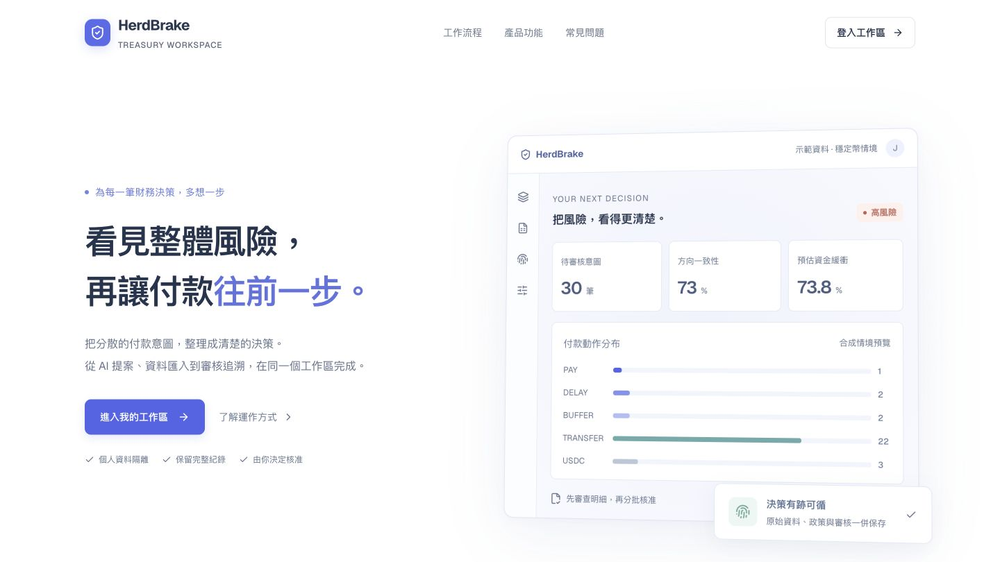

# HerdBrake — 財務 AI 的付款前煞車

**BUILDMODE × SITCON 2026 · T066 我女友好正**

陳廷安（jesse）、施博瀚（Stan） · **AI Agents & Automation** · [MIT 授權](LICENSE)

讓三個部門的 AI 先提出付款決策，再由確定性風控與人工核准共同把關。模型不能直接付款，也不能改寫金額、目的地或政策。

- [技術文件與來源揭露](docs/TECHNICAL.md) · [評審操作指南](docs/DEMO.md) · [三分鐘展示與問答](docs/JUDGES.md) · [提交資料](docs/SUBMISSION.md)
- 真實 Qwen 推論、合成發票、可重現紀錄；後端具備帳號隔離、D1 交易、政策版本、累計核准限制與證據匯出。
- 未串接真實銀行或區塊鏈資金移轉；不宣稱已取得真實客戶成效。

[](https://github.com/nrps9909/herdbrake/actions/workflows/check.yml)



## 誰會需要這個工作區

我們的目標使用者假設是管理多部門付款的財務主管：部門各自提交的付款都低於單筆上限，合併後卻可能突破同一批次的現金底線。HerdBrake 將模型提案、政策快照、人工核准與累計金額放在一起，讓審核者看見每次核准的影響。這個使用者需求仍待實際訪談與導入驗證。

固定案例的公開示範使用 US$32m 期初資金、90% 保留底線，故可核准額度為 US$3.2m。同一份真實模型紀錄提議付款 US$5.4m；先核准三筆關鍵薪資 US$2.7m 後，剩餘額度是 US$0.5m，再要求新增 US$1.8m 會被後端拒絕。這是合成案例中的限制驗證，沒有宣稱節省真實資金或工時。原始數據見 [驗收證據](docs/acceptance/demo-evidence-2026-09-06.json)。

AI 提供兩種資料來源：保留十二張合成發票的穩定展示；也能讀取 **1–24 張自訂發票、最多三個部門**，分別產生真實模型提案。自訂發票的部門預算由後端累計檢查；一般「匯入批次」則直接處理已選定動作的 CSV。完整功能界線與既有產品比較見 [評審說明](docs/JUDGES.md)。

最近的完整操作驗收見 [功能升級與實測](docs/acceptance/workflow-upgrade-2026-09-06.md)：自訂 AI 發票、逐筆核准、安全重試與瀏覽器獨立驗證。

## 評審快速啟動

使用 **Node.js 24 LTS**：

```bash
git clone https://github.com/nrps9909/herdbrake.git
cd herdbrake
npm ci
npm run db:migrate:local
npm run dev
```

開啟 `http://localhost:3000` → 進入工作區 → **AI 付款協作** → **重現已錄製推論**。只需 Node 與 npm，即可操作完整審查流程；不需要 API 金鑰。這是明確標記的真實推論紀錄重現，不會在背景重新呼叫模型。

即時推論另需啟動 [Ollama](https://ollama.com) 並執行 `ollama pull qwen3.5:4b`；開發環境會連線本機 `127.0.0.1:11434`。亦可在啟動前設定 `OLLAMA_BASE_URL`、`OLLAMA_MODEL`。正式建置不會自動啟用本機模型。

本機登入是開發外掛提供的測試身分；**不要將開發伺服器公開到網際網路**。正式身份隔離需透過 Sites 代管登入。已知部署限制與尚未完成的整合均列在技術文件。


HerdBrake combines payment CSV import, deterministic batch risk assessment, human review, durable history and verifiable audit evidence. The public product page leads to a personal workspace authenticated through Sites / ChatGPT. There are no subscriptions, pricing tiers or billing integrations.

## Run locally

Use Node.js 22.13+ (Node 24 in CI).

```bash
npm ci
npm run db:migrate:local
npm run dev
```

Open `http://localhost:3000/` and select **登入工作區**. The official Sites Vite plugin supplies a clearly local test identity; no real credential is required locally. Hosted authentication belongs to the Sites dispatcher. Local mock sign-in is not bundled into the production Worker.

## What works

- **Overview:** counts come from owned D1 records; the current batch shows its actual liquidity and action distribution. Empty workspaces provide import and scenario onboarding.
- **Import:** UTF-8 CSV, 32 KiB, 1–50 intents, six required columns, quoted values, row-level errors and a preview. Invalid rows or stale policy versions prevent the entire import. Supported currencies: TWD, USD, USDC. Import amounts are positive, at most two decimal places and within the configured per-intent USD limit.
- **History:** owner-scoped search, risk filters, stable pagination (20/page), reopen by URL and CSV export. Spreadsheet formula-like user text is neutralized on export.
- **AI collaboration:** keep the twelve-invoice demo or provide 1–24 custom invoices across up to three departments. Each independent Qwen session sees only its department. Amounts/currencies/destinations are fixed by the input, while PAY/DELAY and raw reasons come from the model. Custom department budgets are enforced cumulatively at approval. A complete versioned trace binds the input, policy, model response and resulting intents.
- **Scenario lab:** six reproducible 30-intent scenarios; local preview is explicitly unsaved. Saved results retain their original policy snapshot.
- **Review:** choose exact rows with checkboxes, use the count/priority controls, or request a feasible suggestion that still requires human confirmation. Review selected intent IDs, original currencies, converted total, priority control, written reason and explicit confirmation. Up to ten held intents per approval; actor and scope are recorded. The request includes the reviewed audit head and a reusable idempotency key. Cumulative approved outflow plus the new request must remain within the captured liquidity floor and per-intent limit; over-budget requests return 422 without changing the batch. The review previews exactly the same IDs and calculation.
- **Evidence:** public `/verify` and the workspace can independently verify a JSON file in the browser without uploading it. The shared nine-check verifier also powers the CLI. Includes persisted timeline, SHA-256 audit chain, original-intent commitments, policy/metadata consistency, release-state and cumulative-budget verification, real duplicate-nonce constraint probe and JSON download.
- **Settings:** workspace name, liquidity, concentration, herd threshold, CSV limit and manual currency conversion; optimistic concurrency and the latest twenty policy versions.
- **Interaction:** responsive sidebar/mobile navigation, accessible dialogs, keyboard batch search, loading/error recovery, bookmarkable views and sign-in return paths. Optional WebMCP tools preserve human-only approval.

## Validation

```bash
npm run check                 # lint + strict types + 67 tests + production build
npm run db:migrate:local
npm run test:integration      # owns a local server on port 4317; stops it afterward
```

Stop the existing development server before using the self-contained integration runner. For an already-running **development** server, use `npm run test:api`. Override only a local address with `HERDBRAKE_TEST_ORIGIN`. Eight HTTP integration tests test AI provenance and retries, all six scenarios, real D1 concurrency, authentication, header-spoof rejection, CSRF protection, imports, policy conflicts, search and evidence/CSV downloads. They create local synthetic records and one unchanged-content policy revision; they never target a hosted Site.

The unit/repository tests execute actual SQL against Node's built-in SQLite with transaction rollback, including legacy migration, per-account isolation, policy races, tampering, CSV edge cases and mutation limits. `.github/workflows/check.yml` installs the lockfile and runs the same checks using [GitHub's official actions](https://github.com/actions/setup-node). Current commit results are available in [Quality checks](https://github.com/nrps9909/herdbrake/actions/workflows/check.yml); earlier acceptance records retain the CI links for their historical versions.

The first submission audit added six offline evidence tests (61 total). The workflow upgrade adds six tests for custom inputs, exact approval and retry recovery (67 total), plus an eighth HTTP integration test. The v0.2.0 video records the earlier 55-test version and remains a valid demonstration of the fixed invoice scenario. New controls and custom-invoice behavior are documented in the latest acceptance record. To verify a downloaded evidence package without running the server:

```bash
node --experimental-strip-types scripts/verify-evidence.ts docs/acceptance/demo-evidence-2026-09-06.json
```

This independently checks structure, hashes, audit continuity, commitments, policy snapshots, authorized release state, cumulative limits, model provenance and the server's reported checks. It detects internal inconsistencies, including changes followed by recomputing the outer hash; it cannot authenticate a package whose entire history has been rewritten consistently without a trusted external signature or checkpoint.

The [September 5 acceptance](docs/acceptance/2026-09-05.md) covers the public page and seven original workspace views on desktop and at 390px mobile width, plus a 768px tablet overview. The [September 6 acceptance](docs/acceptance/2026-09-06.md) adds actual AI inference, the eighth workspace view, dependency security updates and the final demo. See [current SITCON readiness](docs/SITCON-readiness-2026-09-06.md) and [submission materials](docs/SUBMISSION.md). Viewport simulation does not establish physical-device or hosted acceptance.

To check the built Worker locally:

```bash
npm run start -- --port 3001 --persist-to "$PWD/.wrangler/state"
```

That production preview deliberately has no local sign-in simulator. Public routes, health, assets and anonymous access rejection can be checked there. Signed-in production acceptance must use the Sites dispatcher.

## Architecture

| Layer                                                            | Responsibility                                                                                             |
| ---------------------------------------------------------------- | ---------------------------------------------------------------------------------------------------------- |
| `app/page.tsx`, `app/workspace/page.tsx`                         | Public product page, server-side identity gate and safe return navigation                                  |
| `components/workspace/`                                          | Separate overview, history, import, ledger, lab, evidence, settings and review views                       |
| `hooks/use-workspace.ts`                                         | Request lifecycle, stale-response cancellation, mutation coordination, restoration and safe approval retry |
| `lib/client-api.ts`, `lib/contracts.ts`, `lib/policy.ts`         | Typed transport, timeouts and shared runtime validation                                                    |
| `lib/server/access.ts`                                           | Identity, same-origin mutation controls and per-account rate limits                                        |
| `lib/server/assurance-repository.ts`                             | D1 transactions, ownership, snapshot reads, idempotency, audit sequencing and integrity                    |
| `lib/server/workspace-repository.ts`                             | Policy versions, concurrency and request budgets                                                           |
| `lib/herdbrake.ts`, `lib/import-csv.ts`, `lib/assurance-core.ts` | Pure risk logic, bounded CSV parsing/export and canonical hashing                                          |
| `db/`, `drizzle/`                                                | Schema and append-only migrations                                                                          |

API handlers return non-cacheable data, bounded error messages, request IDs and structured internal-failure logs without request bodies or identity details. JSON bodies are capped at 8 KiB (40 KiB for CSV import and AI input). Mutations are capped at 60 per account per minute with `429` and `Retry-After`. This is an application budget; platform-level traffic protection is a separate hosting control.

## API

`GET /api/openapi` documents API version 2.0 / OpenAPI 3.1.

| Endpoint                                        | Behavior                                                 |
| ----------------------------------------------- | -------------------------------------------------------- |
| `GET /api/health`                               | Read-only D1/schema health, 503 when unavailable         |
| `GET/POST /api/agents` | Model status, live inference or labeled replay with durable provenance |
| `GET/PATCH /api/workspace`                      | Owned settings, version history, optimistic save         |
| `GET /api/runs`                                 | Latest owned run, or `204`                               |
| `GET /api/runs?list=1&search=&state=ALL&page=0` | Filtered history and actual workspace totals             |
| `POST /api/runs`                                | Persist a synthetic scenario                             |
| `POST /api/runs/import`                         | Validate and persist CSV with reviewed policy revision   |
| `GET /api/runs/:id`                             | Consistent original batch plus current review state      |
| `POST /api/runs/:id/release`                    | Idempotent human approval, bound to reviewed audit head  |
| `POST /api/runs/:id/replay`                     | Real nonce-constraint probe and durable audit entry      |
| `GET /api/runs/:id/evidence`                    | Original data, policy, integrity checks and package hash |
| `GET /api/runs/:id/csv`                         | Current intent CSV attachment                            |

All data routes require a signed-in owner. Writes additionally require `x-herdbrake-client: workspace` and a same-origin request. This marker is not authentication. Requests for another user's run return `404`, including requests replaying an existing idempotency key.

Concurrent approvals use a unique `(run_id, sequence)` index as an optimistic lock inside a D1 batch. Competing writes roll back instead of branching the chain. Identical retries return the original response. Invalid evidence, stale heads and conflicting keys return `409`. A rejected liquidity/per-intent/custom-department approval returns `422`. Scenario, CSV and AI creation accept a UUID requestId bound to the input; unchanged concurrent retries save one batch, and changed content under the same ID is rejected. The browser retains only a fingerprint and UUID in tab-scoped session storage for up to 24 hours so an uncertain creation can recover after reload when the original input/policy is re-entered. No invoice contents are stored there. A confirmed successful creation clears the pending identity. API clients that omit the optional creation UUID intentionally create a new batch each time.

## Authentication and migration

Production identity is trusted only behind the Sites dispatcher, which supplies the stable user ID and strips caller-supplied identity headers. Do not expose the Worker as a standalone public origin or add routes that accept identity from the client. `/signin-with-chatgpt`, `/signout-with-chatgpt` and `/callback` are platform-owned top-level navigations, not application endpoints. Workspaces are personal; team membership and dual approval are not represented as implemented features.

Apply every generated migration in order. `0001` preserves existing event hashes while adding sequence/revision and request hashes. `0002` adds ownership, batch metadata, policy snapshots/history and mutation budgets. Existing rows with `owner_id = NULL` remain preserved and inaccessible through the application; never automatically assign shared historical records to the next person who signs in. Any later legacy-data recovery needs verified ownership and an explicit migration, not a public claim endpoint.

The migration command is local-only and safe to repeat. This refactor updates source and local test data; it does not publish the existing Site or change its hosted database.

## Evaluation boundaries

CSV imports contain the user's supplied data; scenario data is synthetic. Approval updates durable intent state only. No bank transfer, wallet signature, custody or automatic funds movement occurs.

The engine measures the entire proposed batch, including approved items. Approval changes review state, so it need not reduce the original batch's risk. Currency conversion uses the batch's captured manual policy, not a live market quote. The per-intent limit applies at CSV/scenario admission and approval. Scenarios that exceed a custom policy limit cannot be saved as individually valid. Custom-invoice department budgets also apply within the saved batch. Each batch has its own budget; no shared bank-account balance or cross-batch reservation exists. Converted outflows reserve whole USD cents with conservative rounding, excluding DELAY and BUFFER.

Hash chains detect inconsistent content; they are not immutable storage or external signed attestations. The evidence package exposes each check separately. Infrastructure backups, external anchoring and live payment integrations are not claimed by these checks.

## Synthetic guard benchmark

```bash
node --experimental-strip-types scripts/benchmark.ts
```

This writes `docs/acceptance/synthetic-benchmark.json`. The six scenarios at ten severity levels contain 1,800 synthetic intentions: four original full-batch liquidity breaches and zero breaches after guarded sequential approvals. This checks an invariant of the current deterministic policy, not model quality, user outcomes or a globally optimal payment schedule.
