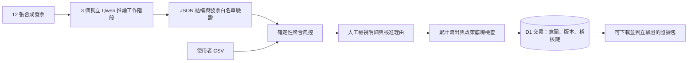

# HerdBrake 技術說明

**T066 我女友好正｜陳廷安、施博瀚｜AI Agents & Automation**

HerdBrake 是財務 AI 提案的執行前審查層。三個部門代理各自處理到期發票，應用程式合併其提案，檢查現金底線與集中度，再交由人員分批核准。核准僅更新意圖狀態，沒有銀行或鏈上資金移轉。

## 30 秒了解實作

## 真正的 AI 在哪裡

`lib/agent-workflow.ts` 向 Ollama `/api/chat` 發出三次獨立請求。模型為 `qwen3.5:4b`，使用 JSON Schema、temperature 0、think false；只保存輸入、結構化決策、業務理由、模型名稱、時間與 token 數，不保存隱藏思考過程。

每個代理只看自己部門四張發票和部門預算。模型只能選 PAY 或 DELAY，不能提供新的金額、收款帳號、付款指令或政策。重複／未知／漏掉的發票、其他動作、額外欄位、不完整回應都會被拒絕；上游失敗不建立批次，也不切換成偽造的 AI 結果。

`fixtures/agent-recording.json` 是 2026-09-06 實際執行取得的完整原始推論，附 SHA-256。第一次紀錄有 6 筆 PAY、6 筆 DELAY，提議流出 US$5,400,000。部分理由錯估剩餘部門預算，原樣保留，沒有為了展示修改模型答案。這也是設計上不讓模型自己核准的原因。

「重現已錄製推論」不會再呼叫模型。它驗證原始指紋，再套用當前工作區政策建立新的待審批次；UI 與證據均標記 recorded。它提供離線展示備援，不代表新的推論或多模型共識。

## 後端防護

- **身分與資料隔離**：正式環境由 Sites 驗證登入；每次讀寫均綁定 owner。跨帳號查詢回 404。公開部署不能直接暴露信任身分標頭的 Worker。
- **政策快照**：每批保留建立時的限額、匯率、底線及版本。工作區設定使用版本衝突檢查，舊批次不隨新設定變動。
- **金額限制**：單筆上限在建立及核准時檢查；累計已核准流出以保守的美元分整數換算計算，不能突破該批預算。DELAY/BUFFER 不消耗付款預算。
- **人工核准**：需明確確認、8–160 字理由、1–10 筆範圍及目前稽核指紋。超額為 422，過時版本為 409；拒絕不改意圖或稽核版本。
- **並行與重試**：核准的唯一序號在同一 D1 交易內防止分叉；冪等鍵綁定請求內容。AI 工作流也保留 requestId，以便傳輸失敗後讀回同一批。一般情境建立和 CSV 匯入未宣稱完全冪等。
- **限流與輸入**：帳號每分鐘 60 次變更；即時模型每分鐘另限 3 次。限制 JSON/CSV 大小、同源請求與下載公式注入。
- **證據**：資料承諾、事件鏈、核准狀態、政策快照、累計核准政策分別驗證。模型紀錄納入起始稽核事件。SHA-256 可發現不一致，並非外部簽章或不可竄改基礎設施。

## 從全新環境執行

使用 Node.js 24 LTS，安裝與啟動步驟見根目錄 README。評審只需 Node 與 npm，就能重現錄製的 AI 提案、匯入 CSV、人工核准與下載證據。即時推論另需 Ollama 和該模型。無需 API 金鑰或付款服務。

`npm run check` 執行靜態檢查、型別、純邏輯及 SQLite 交易測試與正式建置。`npm run test:integration` 自行啟停本機 Worker 驗證 HTTP、登入、D1、衝突、核准與證據；先停止手動開啟的 dev server。

正式原始碼已在 GitHub 公開，並通過 [CI 33984471381](https://github.com/nrps9909/herdbrake/actions/runs/33984471381)。實際 UI 即時推論的原始證據與後端拒絕結果見 [9/6 驗收](acceptance/2026-09-06.md)。

## 已知界線

這是可操作、可驗證的黑客松原型。尚未有真實財務使用者成效研究，未接銀行、錢包簽名、鏈上交易、即時匯率、跨批共用資金餘額、雙人簽核或正式備援維運。使用相同模型的三個工作階段，不代表獨立模型風險分散。合成壓測驗證政策不變量，不代表真實風險預測準確率。

## 來源與授權

專案程式採 [MIT](../LICENSE)。第三方直接依賴與授權列於 [dependency-licenses.json](dependency-licenses.json)；完整相依版本在 package-lock.json，套件各自保有原始授權。

使用既有 HerdBrake 原型持續開發，保留 Git 歷史；2026-09-05 重構工作區、資料隔離、政策與核准流程，2026-09-06 加入真正模型工作流、提交素材及依賴安全修補。使用 OpenAI Codex 協助分析、程式、測試與文案；執行時的財務提案模型是 Qwen，不能把開發工具描述成產品內的 OpenAI API 呼叫。網站使用 OpenAI Sites 開發框架與身分整合。

合成發票和六種規則情境由專案產生；無真實客戶、銀行或合作企業資料。影片使用本機產品實際操作畫面及系統合成旁白，未使用第三方背景音樂。Qwen 模型由 Ollama 另行取得，權重不隨本儲存庫散布，依上游模型授權使用。

研究背景：[BIS Working Paper 1310](https://www.bis.org/publications/working-paper-1310-ai-agents-cash-management-payment-systems)、[Bank of England July 2026 Financial Stability Report](https://www.bankofengland.co.uk/financial-stability-report/2026/july-2026)。它們是問題背景，未與本作品合作或為本作品背書。

實作格式依據：[Ollama Chat API](https://docs.ollama.com/api/chat)、[Structured Outputs](https://docs.ollama.com/capabilities/structured-outputs)。
